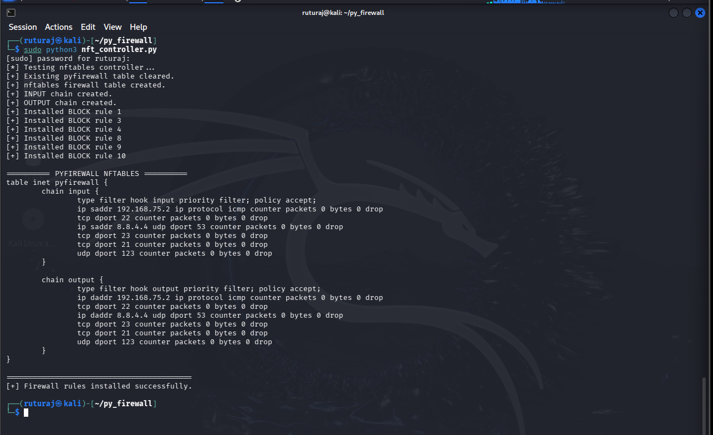
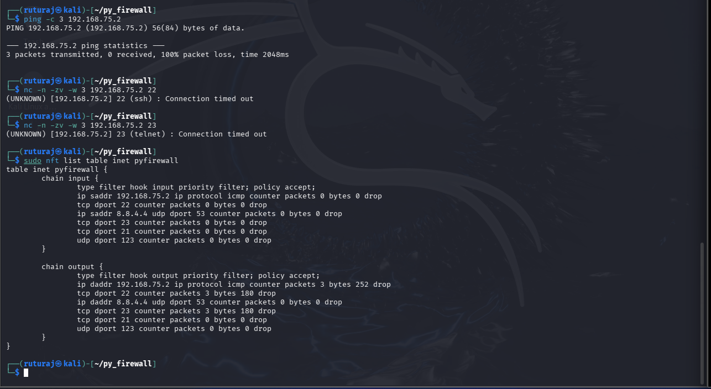
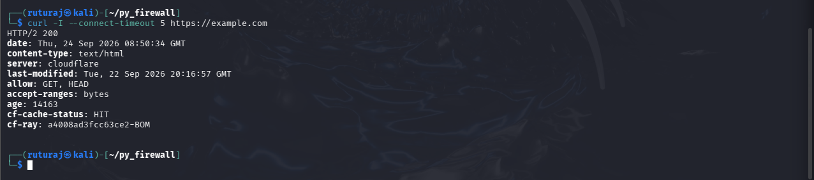
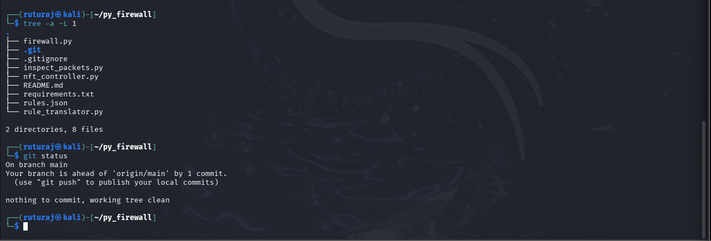

# Py-Scapy Firewall

A Python-based rule-driven network firewall project that combines **Scapy packet inspection** with **Linux nftables kernel-level enforcement**.

The project separates packet analysis from actual traffic enforcement: Python/Scapy inspects and evaluates packets according to a JSON ruleset, while nftables applies blocking rules directly at the Linux kernel level.

## Architecture

```text
                         rules.json
                             |
                 +-----------+-----------+
                 |                       |
                 v                       v
           firewall.py             nft_controller.py
           Python + Scapy                 |
                 |                        v
                 |                  Linux nftables
                 |                        |
                 v                        v
          Packet inspection        Kernel-level
          Rule evaluation          enforcement
                 |                        |
                 +-----------+------------+
                             |
                             v
                      ALLOW / BLOCK
                             |
                             v
                       firewall.log
```

## Features

* IPv4 packet inspection using Scapy
* TCP, UDP and ICMP protocol detection
* Source and destination IP extraction
* TCP/UDP source and destination port extraction
* JSON-based firewall policy
* First-match-wins rule evaluation
* Configurable default policy
* Structured firewall logging
* Linux nftables integration
* Kernel-level packet dropping for BLOCK rules
* Separate INPUT and OUTPUT enforcement
* nftables packet and byte counters for verification
* Standalone packet inspection utility

## Project Structure

| File                 | Purpose                                                     |
| -------------------- | ----------------------------------------------------------- |
| `firewall.py`        | Main Scapy inspection, rule evaluation and logging engine   |
| `nft_controller.py`  | Converts BLOCK policies into active nftables rules          |
| `rule_translator.py` | Displays the JSON policy as equivalent nftables expressions |
| `rules.json`         | Central firewall policy configuration                       |
| `inspect_packets.py` | Standalone packet inspection utility                        |
| `requirements.txt`   | Python dependency list                                      |
| `.gitignore`         | Excludes generated files and runtime logs                   |

## Firewall Rules

The project currently contains 10 configured rules.

| Rule | Protocol | Port | Target         | Action |
| ---: | -------- | ---: | -------------- | ------ |
|    1 | ICMP     |  N/A | `192.168.75.2` | BLOCK  |
|    2 | TCP      |   80 | Any            | ALLOW  |
|    3 | TCP      |   22 | Any            | BLOCK  |
|    4 | UDP      |   53 | `8.8.4.4`      | BLOCK  |
|    5 | TCP      |  443 | Any            | ALLOW  |
|    6 | UDP      |   67 | Any            | ALLOW  |
|    7 | UDP      |   68 | Any            | ALLOW  |
|    8 | TCP      |   23 | Any            | BLOCK  |
|    9 | TCP      |   21 | Any            | BLOCK  |
|   10 | UDP      |  123 | Any            | BLOCK  |

### Default Policy

```text
ALLOW
```

The nftables INPUT and OUTPUT chains use an `accept` policy by default. The configured BLOCK rules are installed as explicit kernel-level `drop` rules.

The ALLOW entries in `rules.json` therefore represent permitted policy conditions under the current default-ALLOW design rather than separate nftables `accept` rules.

## How It Works

### 1. Packet Inspection

`firewall.py` uses Scapy to capture IPv4 traffic and extracts:

* Source IP
* Destination IP
* Protocol
* Source port
* Destination port

### 2. Rule Evaluation

The extracted packet information is compared against `rules.json`.

The Python rule engine uses **first-match-wins** processing.

Each decision records:

* Direction
* Action
* Rule ID
* Protocol
* Source
* Destination

### 3. Kernel-Level Enforcement

`nft_controller.py` creates an `inet pyfirewall` nftables table containing INPUT and OUTPUT chains.

Configured BLOCK rules are converted into actual nftables `drop` rules.

Example:

```text
tcp dport 22 counter packets 0 bytes 0 drop
```

Matching traffic is therefore dropped by the Linux kernel firewall layer.

The current default policy is `ACCEPT`, allowing traffic that does not match an explicit BLOCK rule.

### 4. Logging

The Python inspection engine writes structured runtime decisions to:

```text
firewall.log
```

Example:

```text
[DIRECTION=OUTPUT] | ACTION=ALLOW | RULE_ID=5
```

The runtime log is excluded from Git using `.gitignore`.

## Installation

Clone the repository:

```bash
git clone https://github.com/ruturajk8301-coder/py-scapy-firewall.git
cd py-scapy-firewall
```

Install the Python dependency:

```bash
pip3 install -r requirements.txt
```

### Requirements

* Linux
* Python 3
* Scapy
* nftables
* Root/sudo privileges for firewall enforcement

## Usage

### 1. Install the firewall rules

```bash
sudo python3 nft_controller.py
```

This creates the `pyfirewall` nftables table and installs the configured BLOCK rules.

### 2. Run the Python inspection engine

```bash
sudo python3 firewall.py
```

The program captures IPv4 traffic on `eth0`, evaluates matching rules and records the decisions.

### 3. Inspect the generated nftables expressions

```bash
python3 rule_translator.py
```

### 4. View the active kernel firewall

```bash
sudo nft list table inet pyfirewall
```

## Verification

Testing was performed in a controlled VMware/Kali Linux lab environment.

### ICMP Blocking

Test:

```bash
ping -c 3 192.168.75.2
```

Result:

```text
3 packets transmitted, 0 received, 100% packet loss
```

The nftables counter recorded:

```text
ip daddr 192.168.75.2 ip protocol icmp
counter packets 3 bytes 252 drop
```

### SSH Blocking

Test:

```bash
nc -n -zv -w 3 192.168.75.2 22
```

Result:

```text
Connection timed out
```

nftables recorded:

```text
tcp dport 22 counter packets 3 bytes 180 drop
```

### Telnet Blocking

Test:

```bash
nc -n -zv -w 3 192.168.75.2 23
```

Result:

```text
Connection timed out
```

nftables recorded:

```text
tcp dport 23 counter packets 3 bytes 180 drop
```

### HTTPS Connectivity

Test:

```bash
curl -I --connect-timeout 5 https://example.com
```

Result:

```text
HTTP/2 200
```

This confirms that HTTPS traffic remained permitted under the default ACCEPT policy.

## Security Model

The project separates four major stages:

```text
Inspection
    ↓
Policy Evaluation
    ↓
Kernel Enforcement
    ↓
Logging
```

**Scapy** is responsible for packet inspection.

**Python** performs rule evaluation and generates the audit log.

**nftables** performs the actual kernel-level packet enforcement.

This separation allows the project to demonstrate both packet-analysis concepts and real Linux firewall enforcement.

## Limitations

This project is an educational firewall implementation and is not intended to replace production firewall solutions.

Current limitations include:

* IPv4-focused packet inspection
* Basic IP/protocol/port rule matching
* No graphical management interface
* No persistent nftables configuration across system reboot
* No advanced connection-tracking policy management
* No IPv6 rule engine in the Python inspection layer
* Rule changes require reloading the nftables configuration

## Technologies

* Python 3
* Scapy
* Linux
* nftables
* JSON
* TCP/IP
* ICMP
* VMware/Kali Linux

## Project Purpose

This project was developed as part of a cybersecurity-focused industrial training project to gain practical experience with:

* Network packet analysis
* Firewall rule design
* Python network programming
* Linux networking
* nftables
* Traffic filtering
* Security logging
* Controlled network testing

## 📸 Project Screenshots

### Project Structure


### Firewall Rules Configuration


### nftables Kernel Enforcement


### Firewall Runtime Verification


### HTTPS Traffic Allowed


### Clean Project Structure

